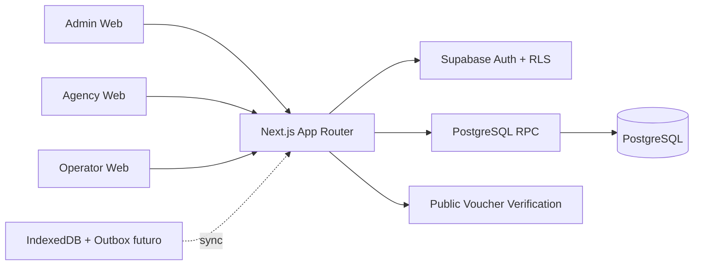

# Galápagos Digital Voucher Platform

<!-- PACKAGE_VERSION:0.1.0 -->
<!-- NEXT_VERSION:16.3.4 -->
<!-- REACT_VERSION:19.2.4 -->
<!-- PROJECT_STATUS:UNSTABLE -->

Plataforma B2B para gestionar disponibilidad, reservas y vouchers digitales de servicios turísticos en las Islas Galápagos. El núcleo del producto es inventario → hold/reserva → pago/confirmación → voucher → redención.

> **Estado actual de `dev`:** S0, R1, R2, R3 y el slice O2/C3.1 de holds e idempotencia están integrados. El último gate Supabase validó **38/38** pruebas reales de Auth/RLS/RPC/PostgREST, incluyendo concurrencia de último cupo, redención y holds. `main` continúa **UNSTABLE / NO PRODUCCIÓN** porque faltan pagos/conciliación, operación completa, observabilidad y deploy/rollback probado. El siguiente frente es **C3.1 — Payments & Booking Lifecycle**. Consulta [CURRENT_WORK.md](./docs/roadmap/CURRENT_WORK.md) y [BASELINE.md](./BASELINE.md).

## Lectura obligatoria antes de modificar código

1. [BASELINE.md](./BASELINE.md) — estado real y deuda vigente.
2. [CURRENT_WORK.md](./docs/roadmap/CURRENT_WORK.md) — siguiente frente exacto y Definition of Done.
3. [AI_CONTEXT.md](./AI_CONTEXT.md) — reglas técnicas obligatorias.
4. [AGENT_PROTOCOL.md](./AGENT_PROTOCOL.md) — protocolo para agentes de IA.
5. [INDEX.md](./INDEX.md) — mapa documental completo.
6. [Roadmap](./docs/roadmap/ROADMAP.md) — secuencia de evolución.

Una persona nueva debe completar la guía [Onboarding en 15 minutos](./docs/guides/ONBOARDING_15_MIN.md) antes de realizar cambios.

## Arquitectura de alto nivel



Detalles: [docs/architecture/system-overview.md](./docs/architecture/system-overview.md).

## Stack

- Next.js 16.3.4, App Router y Turbopack.
- React 19.2.4 + TypeScript 5 en modo `strict`.
- Tailwind CSS 4.
- Supabase SSR / Supabase JS.
- PostgreSQL + RLS + funciones RPC mediante migraciones Supabase append-only.
- GitHub Actions para gates de documentación, producción, integración Supabase y E2E crítico.
- Playwright fijado en CI para el gate de navegador, sin incorporarlo todavía al lockfile principal.

## Rutas actuales

| Área | Ruta | Estado |
|---|---|---|
| Login | `/` | Funcional; redirect y `next` protegidos por rol |
| Admin | `/admin` | Parcial; altas reales de agencias/tours/embarcaciones |
| Agencias | `/agency` | Búsqueda server-side, contexto de agencia, comisión y reserva reales |
| Reservas agencia | `/agency/reservations` | Historial/cancelación reales; holds disponibles en backend |
| Operador | `/operator` | Ownership de flota validado; operación todavía parcial |
| Cupos | `/operator/availability` | Mutación por RPC con ownership |
| Redención operador | `/operator/redeem` | Verificación y redención online mediante RPC atómico |
| Voucher público | `/verify/[token]` | Validación online, QR y estado de redención |

## Inicio rápido

```bash
npm ci
cp .env.example .env.local
# Configura las variables públicas de Supabase
supabase start
supabase db reset
npm run dev
```

El lockfile está sincronizado y `npm ci` es la instalación autoritativa. Un fallo de `npm ci` es un bloqueo nuevo, no una deuda aceptada.

## Comandos de calidad

```bash
npm run docs:validate
npm run docs:health
npm run changelog:validate
npm run lint
npm run typecheck
npm test
npm run build
```

Para pruebas RLS/RPC reales, con Supabase local levantado y variables locales de prueba:

```bash
npm run test:integration
```

El baseline actual es **38/38** pruebas de integración. `Critical E2E` valida en Chromium el flujo agency → búsqueda → reserva → voucher y el flujo operator → redención → bloqueo del segundo uso. La guía completa está en [docs/guides/TESTING.md](./docs/guides/TESTING.md).

## Flujo Git obligatorio

```text
dev actualizado
  ↓ crear feature/*, fix/* o docs/*
rama de trabajo
  ↓ pruebas + PR + CI + review
dev
  ↓ solo al cerrar un hito
PR dev → main
```

**No hacer push ni merge directo a `dev` o `main`.** Aunque GitHub todavía no aplique todas las reglas de protección en `dev`, la política del proyecto sigue siendo obligatoria. Ver [docs/guides/GIT_WORKFLOW.md](./docs/guides/GIT_WORKFLOW.md).

## Principios no negociables

- No bypass de RLS para resolver problemas de permisos.
- No lógica crítica de inventario, pagos o redención en el cliente.
- No mocks presentados como funcionalidad productiva.
- No merge con CI rojo.
- No cambio de contratos, roles, tablas o comportamiento público sin documentación asociada.
- No confundir total reservado con dinero cobrado.
- Reservas productivas deben pasar por RPC transaccional.
- Cambios de permisos requieren pruebas positivas y negativas contra Supabase real.

## Próximo frente

**C3.1 — Payments & Booking Lifecycle**.

Objetivo inmediato: crear un ledger de pagos separado de `reservations.total_price`, definir estados e idempotencia de pago/conciliación y preparar el flujo autoritativo `hold → pago aprobado → confirmación → voucher`, sin fingir cobros desde UI. No integrar un proveedor externo hasta que exista una decisión explícita de proveedor/contrato. Alcance y DoD: [CURRENT_WORK.md](./docs/roadmap/CURRENT_WORK.md).

## Estado de producción

Los criterios completos están en [PRODUCTION_READINESS.md](./docs/guides/PRODUCTION_READINESS.md). `dev` está estabilizado y probado, pero `main` todavía no debe tratarse como release productivo.
