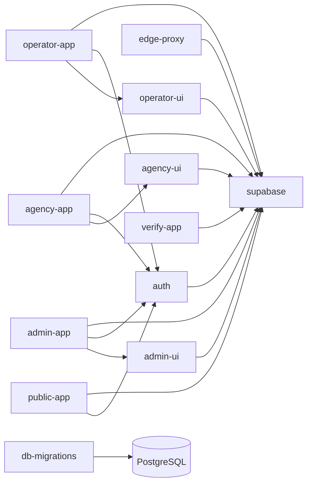

# Mapa de módulos y dependencias

Este archivo contiene marcadores consumidos por `scripts/docs-health.mjs` y `scripts/validate-doc-sync.mjs`. No borrar ni renombrar marcadores sin actualizar los scripts.

## Cobertura documental

<!-- MODULE path=src/app/page.tsx doc=docs/architecture/modules/public-entry.md name=public-app -->
<!-- MODULE path=src/app/admin doc=docs/architecture/modules/admin.md name=admin-app -->
<!-- MODULE path=src/app/agency doc=docs/architecture/modules/agency.md name=agency-app -->
<!-- MODULE path=src/app/operator doc=docs/architecture/modules/operator.md name=operator-app -->
<!-- MODULE path=src/app/verify doc=docs/architecture/modules/voucher.md name=verify-app -->
<!-- MODULE path=src/components/admin doc=docs/architecture/modules/admin.md name=admin-ui -->
<!-- MODULE path=src/components/agency doc=docs/architecture/modules/agency.md name=agency-ui -->
<!-- MODULE path=src/components/operator doc=docs/architecture/modules/operator.md name=operator-ui -->
<!-- MODULE path=src/components/voucher doc=docs/architecture/modules/voucher.md name=voucher-ui -->
<!-- MODULE path=src/lib/auth doc=docs/architecture/modules/auth-security.md name=auth -->
<!-- MODULE path=src/lib/supabase doc=docs/architecture/modules/data-layer.md name=supabase -->
<!-- MODULE path=supabase/migrations doc=docs/architecture/modules/data-layer.md name=db-migrations -->
<!-- MODULE path=src/proxy.ts doc=docs/architecture/modules/auth-security.md name=edge-proxy -->

## Dependencias permitidas observadas

<!-- ARCH_DEP from=public-app to=auth -->
<!-- ARCH_DEP from=public-app to=supabase -->
<!-- ARCH_DEP from=edge-proxy to=supabase -->
<!-- ARCH_DEP from=admin-app to=admin-ui -->
<!-- ARCH_DEP from=admin-app to=auth -->
<!-- ARCH_DEP from=admin-app to=supabase -->
<!-- ARCH_DEP from=agency-app to=agency-ui -->
<!-- ARCH_DEP from=agency-app to=auth -->
<!-- ARCH_DEP from=agency-app to=supabase -->
<!-- ARCH_DEP from=operator-app to=operator-ui -->
<!-- ARCH_DEP from=operator-app to=auth -->
<!-- ARCH_DEP from=operator-app to=supabase -->
<!-- ARCH_DEP from=verify-app to=supabase -->
<!-- ARCH_DEP from=admin-ui to=supabase -->
<!-- ARCH_DEP from=agency-ui to=supabase -->
<!-- ARCH_DEP from=operator-ui to=supabase -->
<!-- ARCH_DEP from=voucher-ui to=supabase -->
<!-- ARCH_DEP from=verify-app to=voucher-ui -->
<!-- ARCH_DEP from=auth to=supabase -->

Una nueva dependencia cross-module que aparezca en imports `@/...` debe añadirse explícitamente aquí y justificarse en el PR.
