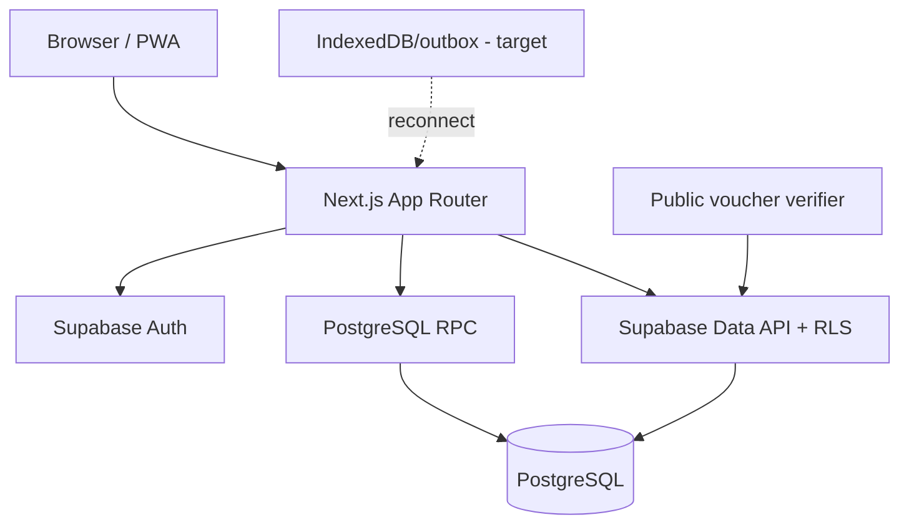

# Visión general de arquitectura

## Contexto

Aplicación Next.js con tres superficies autenticadas (admin, agency, operator) y una superficie pública de verificación. Supabase proporciona autenticación, sesión SSR, Data API y PostgreSQL. Las operaciones sensibles de inventario/reserva deben ejecutarse en RPC transaccionales.

## Contenedores

## Principios

1. PostgreSQL es fuente de verdad para inventario, reservas, voucher y pagos.
2. RLS aplica aislamiento de usuario/organización incluso si la UI se equivoca.
3. Las mutaciones de cupos son serializadas/atómicas.
4. UI nunca infiere “pagado” desde “reservado”.
5. Offline-first usa cache/outbox; no crea múltiples verdades.
6. Contratos de RPC y arquitectura se verifican en CI.

## Fronteras

- `src/app`: routing, composición y server/client boundaries.
- `src/components`: componentes de presentación e interacción.
- `src/lib/auth`: guardias de autorización.
- `src/lib/supabase`: construcción de clientes y refresh de sesión.
- `supabase/migrations`: modelo, permisos y transacciones.

## Dirección de evolución

Separar gradualmente lógica de acceso a datos en dominios (`features/` o capa equivalente) sin reescribir pantallas completas. La migración se hace cuando una funcionalidad se toca, con tests que congelen el comportamiento.
